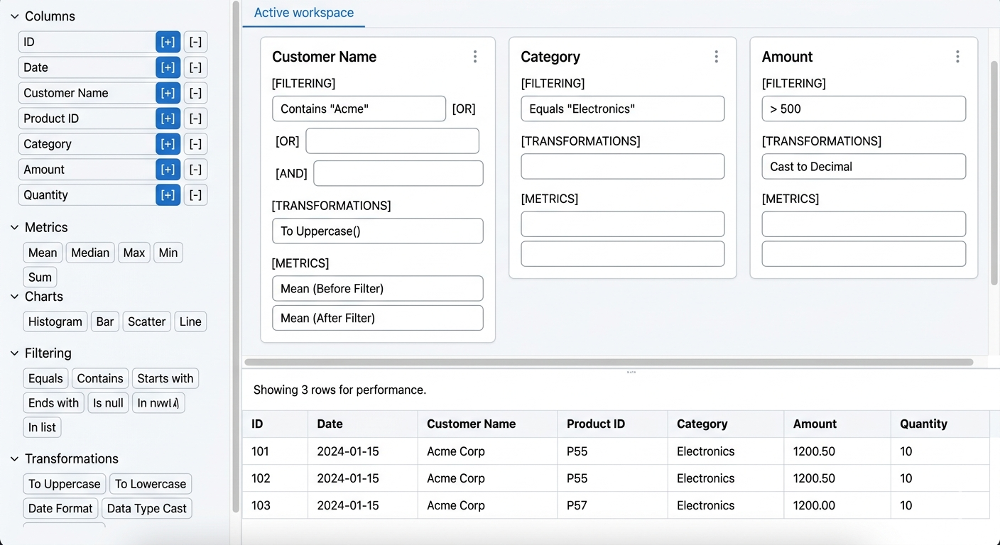

<!-- prettier-ignore-start -->
# Projects
{: .no_toc }

  

    Table of contents
  

  {: .text-delta }
1. TOC
{:toc}

<!-- prettier-ignore-end -->

## Personal Values

- Limit network access to core functionality (no automatic check for updates, ...).
    - Support offline mode. Store local data in simple text formats without encryption so users can view it without the app. If encryption is needed, provide easy access to keys so users can decrypt data outside the app.
- Make software open-source (optionally open-contribution).
    - Provide detailed documentation so users can modify the source code for their needs. This includes writing software that is easy is maintain, and expand. This allows users to debloat the software per their needs. The documentation on customizing software can go as deep as the last if-condition.
        - For example, if the application supports two payment methods (check and payment processor).
        - Write each type in a different file, with common API structure.
        - This allows user to delete one type of payment, or add a third type easily.
    - Never force the user to read the source code to infer logic, valid config options.
    - Provide detailed documentation on DevOps. This lets advanced users integrate and customize the app within their DevOps environment.
        - Allow users to run software locally. If the application can benefit from peer-to-peer, add support for that as well.
        - When applicable, create a centralized website to list local servers.
- Meet accessibility standards.
- No nuisances which includes
    - Forced artificial intelligence.
    - Recommendation algorithms which need user data, history, third-party info.
        - Recommendations derived from a user’s follows and their extended network are permitted.
        - This has downside of confining people to a bubble. Add random recommendations to counter this.
    - Dark patterns.
    - Forced advertisements.
    - Changes to UI/UX should be opt-in, not forced.
        - Made new UI available through an opt-in toggle.
        - Provide documentation on how to move from old UI to new UI. Split the documentation as
            - New functionality.
            - Deprecated functionality. Provide reason.
            - Moved functionality.
- Optimize software, till limited by network, disk I/O.
    - Prefer hardware acceleration.
- Support greatest number of platforms.
    - Ability to use the entire app through API.
        - Allow users to create plugins.
    - Command line support.
    - Terminal user interface support. Use API to create simplified interface.
- Provide an iso file with operating system and ready to use program. This should not require any network access, except for downloading the iso.
    - Also, provide steps on creating the iso.
- Remain neutral. Avoid influence from politics, religion, geopolitics, or other external agendas.
- Respect right to repair. When making hardware do not employ dark patterns to make it harder for people to access, modify, and repair the machine as they wish to.
- An exception to the rules can be created for organizations that don't respect these rules.

---

## Personal Website

Take inspiration from

- https://vale.rocks/posts/the-design-of-this-site#footnote-ref-1
- https://vale.rocks/posts/the-implementation-of-this-site
- https://vale.rocks/posts/writing-style-and-mannerisms
- https://singhkays.com/blog/netflix-av1-decode/ - Use of > and >> in headers
- add terminal like navigation
- [Orizon Design](https://www.orizon.co/) has a dot following the cursor
- Have two dogs playing at the bottom of the screen, jumping and random fighting. You can click on them to shoot or pet.

## Microsoft Migrate

- For all Microsoft products created Excel, Word, VB Script, Access, Azure create alternate tooling to migrate to. For each tool you will have to look at the various versions throughout the years as well.

## OpenKush

- Create open source version for services that can be considered basic utilities in modern digital world.
- Register main domain `openkush.com`.

### OpenPay

- Use domain `usa.pay.openkush.com`.
- Payment processsor to rival Visa, Mastercard, Stripe, Square.
- The cost of the system will be distributed equally amonst people based on the usage.

### OpenBank

- Use domain `usa.bank.openkush.com`.
- Bank which is only used for debit account (checking account).
- Can expand to savings account and take no cut from the investment.
- The payment processor can now become independent from other banks.
- The cost will be supported through OpenPay, since you don't want people to lose money sitting in their account.

### OpenTicket

- Have a ticketing system similar to Ticketmaster.
- Only people with OpenPay/OpenBank accounts, will be able to use the service.

### OpenTax

- Use domain `usa.tax.openkush.com`.
- Can be added as a feature of the bank or an independent product.
- Convert the entire tax code to a software which makes paying taxes as simple as clicking a single button.

### OpenTLD

- In addition create your down top-level domain `.kush` and get free from ICANN.
    - Create own ip standard with maybe 5 parts similar to ipv4 and more bits for each part. Use the syntax 123-234.x.x.x to signify the ip ranges. In this way the ip string will always include the 3 dots and either have two numbers in each section separated by a dash.

### OpenISP

- Create your own ISP.
- Include phone number with additional digit if necessary.

### OpenAuth

- Auth service to let people host locally or use the provided cloud server.
- To replace Google login.

### OpenShop

- Shop service similar to Amazon. Delegate the delivery to UPS, Fedex.
- It is important for people to sell/buy products freely.

### OpenPoll

- Poll/voting service to let people create polls and vote on features.

### OpenSocial

- Social media that keeps the content only for certain timeframe.
- The idea being social media is important to let people communicate with others in case of emergency.
- Extend this to include chat messaging, live video (discord, slack).

### OpenPhone

- Create a phone with open-source blueprint and modular approach.
- Every component can be individually purchased and integrated into the system.
- Adventure related stuff
    - Create a case that seals the entire phone and will help it float in case it drowns.
    - Add attachement for satellite communication.
- Create 2 battery variations.
    - One that just fits.
    - Create a thicker version, that increases the thinckness of the phone as well.
- For every component, provide alternatives and what features are unnecessary for each System on a chip, and how each SOC feature can be enabled or disabled. Also, include option to remove the SOC.
    - Example: Allow multiple Wifi chips to be compatible with the phone, and also having no Wifi chip at all.

### OpenLaptop

- Create a laptop where the cpu, ram, storage is inside the keyboard.
- Have the keyboard be assembled so people can use their custom mechanical keys.
- Attach monitor panels, with stands on the side so the monitor can be positioned at eye level.
- Have detachable numpad so it can be put on either side.
- For the trackpad area, have it as an attachable as well. The trackpad can be placed at any spot.

### OpenInsurance

### OpenBrowser

- Create own internet specification, and club them into Internet v2.
- Browser will not have cookies. auth/pay will be controlled by the browser. accessibility/design system will be controlled by browser.
- In the frontend framework, use directory structure to define functionality
    - keyboard shortcuts, event listeners (reactive programming).
    - css modes like print, in separate file.
- Add popular fonts to the browser.
- Define a tree like data structure for defining the laod order of js files. Parallel branches can be fetched in parallel (similar to async).
- For global account like in Chrome you sign in with Google, use OpenAuth or a local version.
- After a working browser has been created. Create a clone of all the popular apps, if multiple can be consolidated into one do that. And make these part of the browser.

### OpenSearchEngine

- Let people go to a url and crawl the website to build their local search engine.
- I can create my own search engine, and when users download it give them the option to remove the websites they don't need.

### OpenFoodTest

- A better alternative to department of health and usda, and an unbiased testing facility for food products and recommendations.
- Add toos like calorie tracker and thenutrient breakdown of all foods you eat. Include supplementation.

## OpenSaas

- Find all the popular and niche SAAS and management systems and create OpenKush version of them.
- To find industries
    - [capterra](https://www.capterra.com/categories/)
    - [North American Industry Classification System](https://www.census.gov/naics/?99967)
    - [Global Industry Classification Standard](https://www.msci.com/indexes/index-resources/gics)

### Laboratory Inventory Management System (LIMS)

- Lims system using quickjs.
- Create an api for the entire project (this is not referring to the http api, but an api for getting info from the global config).
- Now for the UI of the LIMS system, you query the api and build the template. In this way, you can have multiple templates for the system. Every lab can easily build their own template.
    - Updating the software becomes easier as now you only have to update the api and if there are any breaking changes, you make the changes in the template.
    - As part of the default template, make the all the smaller components available for people to build their template on as well.
- Links
    - [link](https://www.labbit.com/) labbit
- On instrument page, drop file and choose any needed parameters, so that the loading of data is not dependent on filename. In case of incorrect format, show example of correct format.
- On sample submission page for client, ask for what tests they are requested in, and then ask for the relevant information for each test. Group the input fields or data they need to provide for sample into separate groups. One group would be the "minimum information required", and then admin can create more groups. Have each test associated with multiple groups if needed. Show the groups after user has done selecting all tests.
- On the permissions page to control access of employees to internal pages, use glob patterns to provide access to pages for employees. Document how to use glob pattern like file name, \*, \*\*. And any performance issues.
- On generated reports, show additional available insights or analysis. Like for feeds, the clients can run PMN calculator.
- For each sample, you will have to store the instrument minimum thresholds as well, since the thresholds can change over time. The data for previous samples should remain unaffected when changes are made to minimum thresholds.
    - Similarly, ranges for each element data. These can change over time, but the previous samples should not be affected.
    - In the JSON data for each sample, entries can be created for which instrument was used, instrument minimums, element ranges.
- Test all pages and reports using screen readers (JAWS, NVDA, VoiceOver). Include this in accessibility documentation section as well, and how to set them up (be careful with setting up though, since people who already use these would not change their settings for you).
- To add new items in the inventory management system add the following workflow
    - For each item, specify how to handle bringing the item in, how to handle it while moving internally, how to handle when removing.
    - For each action like bringing item in, the user can select from a dropdown or list of text that the admin has created for them.
    - Further split can be created in each category, like any special equipment requirement to handle like gloves, mask, moving with tray.
    - You can also specify, the room numbers where the item can possibly be.
    - This will primarily be text based, and the lab can create their own convention on how to specify the text.
- For employee page, give instructions on how they can line up all the employees and take picture with the best camera using square format head to above belly.
    - On the employee page, admin will select the employee and modify the picture.
- For reading data from instrument, first go to read data page, then choose instrument, then select one of the many tests that are conducted on the instrument, upload the file, choose the required variables (so that the filename does not matter).
- Choose between creating a read data page or incorporating read data on the instrument page. On the instrument page can can create subpages for each instrument like read data, view logs/summary of submitted data, documentation. Create section for installation for both software and hardware on the same page. For hardware this also includes where all the wires connect to the wall and the pc. Also include instrument maintenance and cleaning section.
- Create disaster recovery protocol and include it in the setup docs.
    - Have 2 pages.
    - First for promoting backup setver rack as primary. Focus on restoring database. The backup server is already running at the url like temp.lab.com and is only accessible internally. There is also a flag which prevents any database operation on this temp url, in case someone accidently accesses it. During disaster recovery, we first restore the database on the backup server, change the flag or redeploy with env variable to let all database operations, and now the lab can run as normal using the temp url. The lab can then focus on changing the url to the original.
    - For second backup page, we have to restore from offsite/offline backup. This is where the backip server is also not usable or there is ransomwhare on it. For offline it is not connected to the internet and cannot run any programs.
- Create a reference lims for aesl which is separate from the one they are using. This reference will act as a guide for when labs are building their own. In the documentation the reference lims system will be referenced.
- Have a single left sidebar, which lists all the applications. For something like i struments, it will list all the pages underneath. Do not create two sidebars.
- For each page of the application have an exit function which will run, when the user tries to navigate away from the page. You can use this to check for any unsaved data.
- Look into splitting the database for each year and tracking where the database for that year is stored. For older fiscal years we can move the database to slower archival storage and the programs will still work.
- Add ability to video call, audio call employees. This can get rid of internal phones, and other subscriptions to do zoom and phone calls. Similar to leave page, add a page for meetings, and making it easier to add and view meetings.
    - Add page to do employee polls. And client polls/surveys.
    - Issue tracker, tracker for legal issues.
    - For a lot of these pages, things can be kept simple by letting people enter Rich Text, and the first page being a template page, which users can copy or it gets pasted by default.
    - Page for chatting. Just have simple chat of people sending messages. Show a red dot in the notication bar of the receiptient. At the end of the day send, a summary email to all employees, with all the messages that they received. Instead of defining a single time like 5pm, have an array, and use the messages within two consecutive times to send the summary. Users can create group chats.
- When creating the LIMS system, be mindful of the same lab being spread in multiple places, and each place doing the same tests. Maybe for every test, we need to define an arry of labs that it can belong to.
- Rather than creating user permissions for special things like creating poll, legal stuff. Create a subpage called "Create" which can also be used to make templates. And then the user who has access to the page will be the only one able to create.
- In responsibilities page, add list of responsibilities generated by the lims system. Like all the admin related stuff. Look at each page of the system and figure out what responsibilities you can come up with.
- For login in addition to email/password support email only with 2fa, passkey only (the admin will have to log into the database manually to reset their)
- Documentation will be in English. But the UI will be internatiolized. Make the internaolization build only, so you are generating ui for all the languages in different folders like en, fr.
- When logging in the sample, create a specimen number (similar to sample ID). This can inculde the date and a daily counter,a nd some other information. Look up things like "Importance of sample identification" like 2026-0004521-A.
- AESL workflow is more of analytical workflow, where you run sample in instrument and read the data. Biotech labs are trying to merge different aspects into one big system
- Help labs create workflow modeling, essentially how a sample moves within a lab.
- In instrument page, have global section for when you multiple of the same instrument. You will still have site specific instrument setup instructions.
- Sample tracking page. The page will show all the samples at the lab that still have to be run. A technician will check the page, select the samples that they will be running.
- Data analysis. Create a new page, where technicans can upload Excel file, or run a sql query to get the data. And then do all the data analysis related stuff. Essentially everything that they can do in Excel, libraries like pandas, matplotlib. So filter data, clean data, create graphs, get metrics.
- Create helper for writing SQL. It will show the tables, columns and the user can click them to paste in the editor and with the appropriate data types. Further show all the functions you can write in the where clause. Group them for easier use, and clicking a function would paste it in the editor. Also, create an autocomplete dropdown as the user is typing to fill in the columns, functions.
- For every data table, have option to export to various formats like Excel, txt, csv, json. Have option to open the table in Data analysis page. This data table is not the same as the database table, and instead what is being shown in the UI.
- From the sample submission page, create html editable forms for each test or subset of tests as well. Clients can print the written form, or print and then handwrite the form.
- Create a page to transform Json structure of sample or other cokumn. This will apply the transformation to all the previous samples. There will be some downtime, but that is a tradeoff to make the process simple. There might be times when the lab was storing info from instrument, but now that data needs to be split into 2 columns.
- Create section to for all the word files, excel files, powerpoint files in LIMS. Use HTML to create these instead. The files will be organized by templates (with subfolders) as needed. For every HTML page, there will be an option to load previous entered data or enter new data or modify one of the old data. Save the changes with date and a comment. People can print these pages and share with people. Make these accessible as well.

#### List of LIMS

- https://www.labmanager.com/vendors/products/lims
- https://www.capterra.com/laboratory-information-management-system-software/?sort=alphabetical
- https://limswiki.com/
- https://www.thelabhq.com/

#### SQL page

- Two rows
- The layout fits on the screen and users will have to scroll for the overflow.
- I am essentially helping people build the filters/transformations that data tables generally have he controls for in the table itself. But instead of building those controls int he data table itself, I have the users open this page.
- Bottom row
    - Show a dummy table with multiple columns and 3 rows.
    - Add a message at top. Showing 3 rows for performance.
- Top row
    - Tow column with sidebar on left to select the controls.
        - In sidebar have a group for columns, which will list all the columns of the table. Have + , - sign next to it, to add the column in the right column.
        - Have a metrics group, which will show things like mean, max, .... These metrics can be added for before filtering the data and/or after filtering the data.
        - Have charts group, where users can add various charts for the columns.
        - Have filtering group for things like, startswith, endswith, includes
        - Have transformation group for things like toupeprcase, data type conversion, ...
    - In the right column, for every column added add this ui.
        - Show the column header
        - Show an input box, where they will essentially enter the filtering or transformation.
        - To the righ side have an "or" and another input box. If they type into this, another "or" input would be created.
        - To the bottom have an "and" and another input box. If they type into this, another "and" input would be created.
        - Have different sections for filtering, transformation, metrics within each column, so that users know here to input each thing and they do not get confused.
    - The user can click on the things in the sidebar and it will add them to the active input box.

### Agriculture SAAS

- What are the different types of things where agriculture related stuff is relevant (like water, soil, ...).
- Now dig deeper into each type.
- For water, where are all the places it is used (tap water, water filtration system, desalination systems, agriculture, acquarium, ships, ...).
- For each use case, build a simpler 3d printed model, to understand how these systems are constructed. Like how a tap water is built from the tap, to the pipes that carry the water. These will help identify issues that are impossible to think about just mentally.
- For each use case, identify the analysis or test that is relevant.
- In addition to the 3d model, make an animation that can be used to teach people how the system they are using is constructed.
- Consolidate all agriculture related software companies, precision agriculture, research papers.
- Show how much people are saving by using this project. For every usecase, anlysis show the price from commercial companies.

### Accessibility

- Works on all operating systems. Handles all file formats like Web, PDF.

## VPN Performance Check

- Use vpn to check your site performance across counties.
- Can use aws vps as well.

## Better Tech Name

- Use domain `bettertechname.com`.
- Come up with alternative names for GPUs/CPUs/RAM/Monitors (desktop, enterprise, mobile).
- General strategy: bigger the number better the product.
    - Consult research papers to understand the architecture of each product.
    - Each product begins with the year the architecture was released not the product was released.
- Have a (autogenerated) section for each product to explain the rationale behind the name.
- For USB distill it down to Data and Power (D= and P=).
- Also create SVG logos in different sizes for the new names. Smaller logos will have less/compressed info.

## Programming Langauge

- Create transpiler for programming languages to Rust. For each language look at the top libraries and transpile them as a proof of concept. Also, check performance of the transpiled to the original.
    - If a language has a specific tooling built around it, build that for the Rust version as well.
- Create an intermediate language and transpile from that to target language.

### File Formats

- Create a performance optimized parser (using SIMD assembly) for XML, HTML, CSS, TOML, ...

### Fortran

- Start from 66 standard and work your way up (look into various compiler options also)
- [fortran-lang.org](https://fortran-lang.org/)
- [fortranwiki.org](https://fortranwiki.org/fortran/show/HomePage)
- Wiki has list of libraries using Fortran. Transpile them to C++, make test cases pass, test for performance to act as a proof of concept.
- Use the official compilers for this task.

## Database

- Go through postgres documentation and create an admin panel to configure all the settings, this includes options for compiling postgres from source.
    - For options which can take multiple values like page size, offer a testing utility which users can use to get the best value.
    - Provide guide on meaning of all values and how to choose the appropriate one.
    - [link](https://postgresqlco.nf/) Page listing configuration options and tuning guide.
- Go through all the Postgre Weekly newsletters and add stuff from there.
- Look at databases built on top of Postgres and merge their features.
- Look at databases outside of Postgres and merge their features.
- CLI to create josn schema of all tables, typescript format, format for other languages.
- Some queries integrate data from previous years, and the output rarely changes. The output from previous years can be cached. Create interface where you keep track of such queries and update the cache. If intergation can be made on when was the table last modified, the update of query output can be automated.
- Development database setup and easier way to run queries in dev mode before pushing to production. In dev mode, add methods to easily add worst case inputs for the queries. And also test for performance.
- For migrations provide two functions for each function. How to upgrade and how to downgrade. And then it is to the user to handle the logic. The software handles the execution of these functions and can be used to roll back 100 migrations if the logic allows it.
    - During migration we might have to look into load balancing and how to migrate when the database is really huge.
- High availability
    - patroni
- Add backup testing, backup restore. Disaster recovery.
- Have a test section to test queries like update, delete, create. The section automatically wraps the query in transaction and after you are confident you can commit the transaction.

### Access

- Create transpiler and tooling to migrate from Access database system.

## Coding Live Documentation Viewer

- When writing say Rust, depending on where cursor is, show the official documentation for that thing in a browser window. As you type, the page keeps getting updated.
- For this to work, offline documentation would work best. And for navigation using URL (file path) would be best.
- In addition show custom user documentation, which can include like performance characteristics of each thing, accessibility, security, usage examples, best practices.
- Another pane can show the piece of code at different compiler stages.
- Show the dependency graph of the assmebly for the current function or lines of code. Refer to Casey Computer Enhance course (Linking Directly to ASM for experimentation).
    - Add the ability to modify the assembly manually (temporarily) and see how the dependency graph changes.

## SEO

- Combine all SEO products from [link](https://github.com/serpapi/awesome-seo-tools) into a single app.
    - Add these as well [link](https://kushaj.com/product-design/seo).
    - Wordpress aioseo.
- Reference SEO notes for more ideas.

### PWA

- Create all things needed for PWA.
- Checker which shows the rendering of all the options.

### HTML Head Generator

- To generate a template for all the tags that you can possibly enter in HTML head.
- This can be `<meta>` tags or HTTP relevant or a function that returns the HTML.
- Refer capo.js on how to order head elements for performance.

## HTML checker

- For every HTML tag check if the children tag valid. It will be a hashmap, with a key for each html tag and the value will be a set of all valid tags.
- Show the DOM tree of the code you are working on in the documentation viewer or in a new tab.
- Check if html tags have valid attributes.

## Diagram

- Reference [UI LIbrary-2D visualization](#2d-visualizations) before working on this.
- Reference all the diagramming tools out there and create a single tool with all the features.
- Include collaborative features as well using local server.
- Make it work online completely client side, with option to sync to storage like google drive. Add option to share with people.
- Create a programming language interface to draw the diagram through code.
- Include simple diagrams, software architecture diagrams, devops diragrams, charts (look at charting libraries), graphs.

## Qwik Lite

- Use vite+ for qwik.
- Add schema.org
- Sort the tags in head.
- Helper to view component in different sizes, zooms, and other stuff.
- Remove all the unncessary stuff from qwik like api functions. It should just be a UI layout framework.
- Remove npm dependency. Have all the dependencies already in node_modules folder without a need to install.
- Integrate OpenDesignSystem and other stuff/tools you use.

## UI Library

- Create a UI library for Qwik js (or framework agnostic) with inspiration from shadcn.
- Add design design from UI collective. Split it into files, with the base where you define the colors, and other values being in a separate file, that can be exported and imported easily.
- Look up all the UI libraries out there and add their components.
- For each component, have a separate file/layer for print, accessibilty options, keyboard shortcuts, event listeners.
- Add option to add changes to inputs, text fields, dropdowns to the URL. This is relevant to use URL as state management. Check [/product-design/seo/url.html#url-as-state-management](/product-design/seo/url.html#url-as-state-management).
- Add performance optimization for things like toggle. Even though toggle is a boolean, it takes 1 byte in memory. Multiple toggles can be packed together using bitwise operators. [video](https://www.youtube.com/watch?v=z7wVUfnm7M0).
- Keyboard shortcuts should be opt-in, and give user the option to change them.
- Components
    - Header - Similar to amazon mobile app, the header background fades if you have not scrolled for some time, and then the text fades as well.
    - [link](https://rednegra.net/blog/20260212-virtual-scroll/?ck_subscriber_id=2308324911) Virtual Scrolling for Billions of Rows
- Look at ui/ux related to architecture like nuclear plants and architecture where they have control panels.

### OpenDesignSystem

- This will be the main project for the components.
- First build the design system using raw css and js. Use modern css to split everything into files. For js use modules.
- Write extensive documentation on why the code is structured in the given way to meet semantic guidelines, user experience.
- First folder will contain all the variable like colors and spaces.
- Second folder will be the reset/html tags. Create styles for each html tag individually.
- Component folder. This folder will contain the components.
- After writing js with jsdoc, create a separate version for Qwik.
- Create a component for all the accessibility needs.

### Markdown Editor

- Markdown -> HTML -> PDF
- Show live preview of PDF export.

### CSS Style Sorter

- Sort CSS style properties similar to how Tailwind sort's the class names.
- Add sorting logic for both inline, and stylesheet.

### Media Optimizer

- Image/audio/video/svg best practices in HTML.
- For images, generate responsive img and picture tags.
- Look at sharp, Nextjs img, cloudfare cloudinary.

### Code Snippet

- Create a code snippet module. Check all the documentation generators and copy their features.
- Add compiler outputs, print output, advanced stuff like assembly output, or whatever is relevant to that language.
- See typescript, swift docs for inspiration.
- Add optional feature for formatting the code using offical formatters of each language.
- Comments/Code can be highlighted for warming, danger, info, ...
- All the code in the codeblock should be generated at build time, including line numbers.

### Code Transition

- Code transition animation as seen in youtube videos.
- Component to show code and syntax highlighting like Shiki. Look at astro for all the things it can do.

### Storybook

- Render the component at different resolutions, different browsers.
- It integrates with the design system, and provides a page to adjust the design system and see the new rendering of the components. From the page, the design system can be exported to be used in your library (or just saved directly to the file).
- Integrate testing to show the components for all test cases.
- Add documentation on how to use the component.
- Take screenshots of the components from all browsers. Look into using OBS (or native Linux APIs to capture screenshot).
- Add view of the component with the popular chrome extensions installed

### Accessibility

- In the storybook app, add diffeerent accessibility renderings as well.
- Integrate everything related to accessibility in the app. Things like stark app.

### 2D-Visualization

- Charts.
    - When creating charts, look into how people of different calibre would use and understand the info.
    - For the chart, show how info can be improved, what is redundant, and what extra info can be added to improve comprehension, and what supplementary/complementary charts can be used.
- Graphs.
- Diagrams. Refer [Diagrams project](#diagram) as well, as that will build on top of this.
- Some diagrams where it is of video format, to show flow of data (make it interactive, have the ability to hover and see tooltip). This might be int he realm of 3Blue1Brown animation library.
- Icepanel, Lucidchart.

### 3D-Visualization

### Maps

### Math

- Look at 3Blue1Brown animation library.

### Network/Distributed/Database

- Create visualization like tigerbeetle simulator, for all distributed algorithms and database.

### Documentation Theme

- Combine features from all documentation themes (fumadocs, ...) into a single theme.
- Implement remark and rehype plugins.
- Have internal pages viewed through authentication as well.
- Live code snippets that sync with codebase.
- Add Content Management System.
- Support private/internal pages without server/authentication.
    - Encrypt HTML of the page during the build process, and when user navigates to the URL, the encrypted HTML is shown.
    - User provides one-way password/decryption key, and the webpage decrypts the HTML.

### NoCode Tool

- Create NoCode tool with drag and drop.

### Website Templates

- Add website templates like shopping, documentation, cms, forum site, ticketmaster, erp, sas, sap, github, issue tracking, ...
- Payments page template using info from https://mitchellh.com/writing/advice-for-tech-nonprofits.
- Check youtubes for project ideas
    - Josh tried coding
    - Code with antonio
    - Javascript mastery
- Check popular saas services and homelab solutions.

### Math Equations

### PDF Renderer

- Convert Latex to Webassembly Rust and use it to write PDF and render it on the side.
- Look at book writing software/platforms like writebook, [best book writing software or platform](https://www.reddit.com/r/selfpublish/comments/1gi7yif/best_book_writing_software_or_platform/) for additional features.

### Chemistry

### Random

- Look for niche topics, like electronic circuits.

## HTTP

- Tool for debugging HTTP requests, similar to Proxyman, Chrome Dev Tools.
- Add `curl` integration for making requests from interface, and seeing request, response information in detail.

### CSP

- Create a tool similar to [csper](https://csper.io/) to track/report CSP violations, and suggestions on resolving.
- Option to add HTML head tags to resolve the issue.
- Option to add HTTP headers to resolve the issue.

## Code To UML Generator

- Create program that reads file and removes all code between start and end comment block.
- Use the code in between to generate UML diagram, and generate image from that.
- This can be used to visualize if/else other loop logic regardless of programming langauge, as we are still relying on the user to define the diagram and doing any programming language code parsing.
- The user will have to define an identifier which links the current code to some global object (identifying the function for which we are creating the diagram) and then define the logic for if/else and other things.
- Also, try generating an automatic diagram for the entire code. Start with main function and then all the functions that it calls. Show sequential and parallel function calls.

### Parallel Code Finder

- Find parts of functions that can be parallelized or made async. Do it automatically and compare the performance differences.
- Create a simple UI to show what changes were made.
- Combine this with a profiler where you get time taken by each line, or function. Then you can say the profiler has these lines with the worst performance, reference it with parallel and only optimize these.

## Wayland/X11

- Create a Wayland/X11 alternative.
- Some ultrawide monitors splitting single monitor into 2. Can this be implemented at software level, and let users define custom regions on their monitors, to act as sub monitors similar to ultrawide.
- Dell monitors have Dell Display Manager, which uses DDC/CI protocol to change monitor settings. When creating the alternative, also create a GUI thing, and in the GUI add features from the Dell Display Manager as well (change brightness, color mode, ...).
- Global shortcut for window movement to left, right, top, bottom. Use Win + UpArrow to move window up. Press up arrow twice to expand the window to entire top 50% width. Then downArrow would move it to smaller top region. For multi monitors, do Win + 2 + UpArrow, where 2 is for the second monitor. This will move the window to the number 2 monitor. Also, provide option to define these regions like top-left, top-right, .... And then use Win + arrow keys to move around.
- Use CSS names for all the things. Like for borders, provide option to control border for each window separately. On the programming side, this can be achieved by using a unique dictionary key corresponding to the window and then defining the boder options, including the monitor to show on and the placement within the monitor as well.
    - Include all the unique features from tiling window managers as well.
- Programming interface allows any application to open a new window, with all the config options. As long as the dictionary key name is unique, applications can control exactly how to display their window (this does include things like excluding the top bar with minimize, close buttons, and changing position to top-bar, buttons).
- Explore the idea of unfragmenting Linux, like having universal settings menu.
- Check [river](https://codeberg.org/river/river).
- In display protocol project, include standard linux things that distros dont need to support, and call it unification of distro and helping hardware manufactures support linux, things like power management, wifi, bluetooth, rgb lighting, and more hardware that uses open standards like keyboards. For rgb expand it to include all metrics, like gpu temps, psu, motherboard and others which users can query against to create anything.
- Look at all the popular linux distros and the programs they have like [Omarchy](https://omarchy.org/).

## Basketball Stats

- For every stat in basketball, find its meaning and how to actually use it (without stat padding).
    - For example, number of rebounds is a false metric. Because a reboud can be contested and uncontested, your teammate might box out making it easier for you to rebound. A better look at this metric is what is the rebound number of the team with/without you.
    - For example, number of blocks is a false metric. A better metric is opponent at-rim field goal percentage (on-off). The reason being having blocks does not give complete picture of defense. You may still be weak and get pushed around and in general cannot keep up with defensive assignment. Also, use opponent at-rim shot frequency (on-off).
    - [Video](https://www.youtube.com/watch?v=nhLIh4XQQjo) for reference.
- Do the above for every stat.
- Make it easy to make charts from these, like you see on youtube videos. Let people choose a player and time period and add it to the graph.
- Look at popular youtube basketball videos and add the graphs they use in the program as well.

## Basketball Commentator

- Whil playing 1on1 or 5's capture the footage and make up commentary mimiching NBA or 2k game.
- Have commentary from different personas.

## NBA Game App

- How would a NBA game have played if there was a 4 point line, or the 3 point line was molded into a custom line, with all the related stats.
- Create a leaderboard of who can make the losing team the winner the fastest by modifying the 3 point line.

## Basketball Game Stats

- Use a series of mobile cameras, record live basketball game and get stats of all players.
- Alternatively, put a tracker on the player (a wristband like thing on the shooting hand), rim to track when the basket is made.
    - Algorithm can figure out assist, rebound, score and all advanced nba stats.
    - Put a phone on the corner of the court to get all the data from the wristbands.
    - Before the game, walk the court to map out the coordinates.

## WNBA Shot Predictor

- Get clips of WNBA players shooting ball and do a question on the outcome (miss, fail, foul, fight).
- Make it like a game, every score gets +1 dollar and incorrect gets -1$.
- The target money is the debt wnba is in.
- The program ends when WNBA becomes profitable.

## Linux GUI

- Create Graphical UI to better view and navigate man pages.
- Add all the special linux related files and settings here.
- All the special command line commands that give info about the os and linux, have their output already present here.
- Add KDE plasma, other display manager specific settings.
- Handle operating system differences like certain files existing in different locations, and provide option to change the default path.
- For testing, create a test utility (described next).

### Gentoo Distro

- Create a helper guide for setting up gentoo and customizing all the main software, like linux kernel to keep only the relevant stuff, browsers, text editors, terminal and more. - - Create all the relevant software around to make it feature proof like windows and mac, and popular linux distros.

### Hyprland

- Look at different window managers and if you can create a single GUI to make them feature parity with desktop environments like kde, gnome.
- With window managers expose additional settings, the ones that window managers are known for, like building a taskbar and other things.
- Look at r/unixporn.

### Mac Linux Desktop Environment

- Create a desktop environment for macos, to make it look and behave like Linux.
- Linux shortcuts, linux file structure, linux bash tools.

### Linux OS Testing

- Create Virtual machine.
- Create restore point.
- Run the test, verify, and log.
- Restore back to clean and run the next test.

## Email HTML Creator

- Create tool to make HTML email campaigns.
- Plain HTML/CSS (using Vite might work better).
    - Have a template folder, and have something similar to JINJA syntax.
    - Another folder for emails, which will contain HTML files. Folder structure can used for versioning.
    - Script that creates `out` folder containing the final HTML files, with the templates filled in.
- Reference [HTML Email Development](https://frontendmasters.com/courses/html-email-v2) course.
    - Add tooling for linting, formatting based on the course.
    - If stuff can be added from [Email on Acid](https://www.emailonacid.com/) and [Litmus](https://www.litmus.com/) add that as well.
        - Leave the final checking of the email against email clients to these tool though.
- Tooling to check the email server. Like what protocol is being used, is the email encrypted, ...
- Add design system based on UI collective and simpler component library.
- [mjml](https://mjml.io/) framework for making responsive emails.
- Create GUI similar to nocode tools, for creating HTML email. Example [postcard](https://designmodo.com/postcards/).
- Copy SAAS providers like Litmus.
- Other tools
    - [link](https://www.litmus.com/) litmus
    - [link](https://www.emailonacid.com/) Email on Acid
    - [link](https://designmodo.com/postcards/) Postcards
    - [link](https://www.campaignmonitor.com/) Campaign Monitor

## Rust Dynamic Library

- When installing library through Cargo, all the dependencies have to recompiled. Since rust has no stable ABI, there are differences in the compiled binary across different compiler versions.
- Create a wrapper around cargo installer, which will install/get libraries from a shared folder.
- When the compiler is updated, recompile all the libraries as well.
- Features from security area can be added, like creating dependency graph, checking for outdated dependencies.

## Exercise Research

- Write a paper on how doing multiple sports can prevent injuries.
- Goal: If you are a kid use this protocol, and this might help you with reaching professional league, but this will defintiely help you stay healthier and injury free in your 60s.
- Look at different sports, and parts they normally use, and make a series of sports that cover all parts of the body, without overusing the same part over and over again.
- Look at mentality, physicality aspect of the sports as well.
- Give suggestions like playing with old people, young people, left/right hand, playing with woman if you are a man. This covers playing the same sport slowly (against old people), and faster (against younger people).

## Bike Car Cover

- When carrying bike behind a car, make a cover for it.
- The cover can expand and contract using velcros to support 1 to 4 bikes.
- The cover can shrink to cover smaller size bikes as well.
- Add a bottom cover, so that water does not seep in.
- Add reflective light things on the cover for night time riding.
- Pitch: You need a single cover for a car. The number of bikes don't matter.

## UI Layout

- Build UI layout engine with all CSS properties. Reference [Clay](https://www.youtube.com/watch?v=DYWTw19_8r4).
- Add HTML like frontend with full HTML parsing and streaming (as browsers do it).
- Look at the applications where Clay is used and modify the applications to use your HTML like syntax.

## Militiary Industry Complex

- Show the people who joined private positions and what they held before. And how these people are related to each other.
- For the grants, see which people approved.
- In a table show all the people in militiary industry complez, have a button to show that persons last positions, relationship to others in the table, grants accepted.
- Show how much money is spent lobbying by each company and at which locations.

## Cloud Helper

- For every AWS service create GUI/API to configure all settings.
- Check your current AWS implementation of that service for any anti-patterns and improvements.
- In general provide a better documentation experience.
- Do it for other clouds and then create utility methods allowing you to switch cloud service with a button click.
- Look at [optimesit](https://optimeist.com/).

## Project Dependency Tracker

- For all your personal projects (external projects as well), create a UI that shows all the dependency versions being used.
- Show how the current version compares to the latest.
- Show link to the release notes, and a script that can automatically submit pull request for updating the dependency.

### Personal Info

- In addition to tracking project version, track smaller bits of info that can change over time like name, address.
    - Some text that you put in the README.
    - Some link that you shared. Places where you shared the link.
- Include locations of all your social media, or places where you have created an account, provided payment info, provided address info. And a link to modify/delete the relevant info.

## Configurable Formatter

- Unopinionated prettier alternative. In Markdown, prettier would currently format codeblocks and that would mess up JS code. And the way to avoid this is by adding prettier ignore comments, which is annoying.
- Split the project into core module and language specific modules.
- Clear all [prettier tests](https://github.com/prettier/prettier/tree/main/tests/format) to ensure success.
- All the 3rd party plugins/integrations should work automatically. For this you might have to force people to rename your package to "prettier" manually (or through a script, soft alias).
- Make every formatting option of prettier available as a config option.
- Additionally, code inside codeblocks should be formatted as per the provided language.
- Provide a config file, which includes all the config options, that people can read top-to-bottom. This is one thing that I found annoying with current tools, as you have to check the docs for all possible options and sometimes they are not even documented properly.
- Look at prettier alternatives like [Biome](https://biomejs.dev/) written in Rust and do speed comparisons and OxcFormat.
- For every possible formatting done by Prettier, expose a function letting people build their own logic on how to format that option. For example, if you have code that handle formatting ternaries, then expose a function that can override that behavior.
- Look into all the programming languages out there and integrate their AST into the project, and then provide an option to format each node. This would make the project a universal formatter.

## HTML DOM Analyzer

- There are chrome extensions that deal with analyzing DOM like number of nodes. Consolidate all the extensions into one script/extension.
- Chrome console shows DOM after JS render. Ctrl-U shows HTML returned by the server. In the chrome DOM, spaces and newline nodes are not shows. In your project show these as well.
- Add a graph showing the dom depth.
- Given the html, show step by step the graph being built.
- For browsers, show how this is translated to graphics layers and all the intermediary.

### Parser library

- Create a utility library that exposes the HTML parser, and can work on both full-HTML string and streaming HTML.
- For the streaming HTMl, build a visualization tool to show how the DOM looks over time.
- Show where the parser got halted. Like script, link, style tags halt the HTML parser. How can this information be made available to the users.

## UI Helper

- Take all the advise from UI courses and books and convert it into automatic checker.
- The checker can maybe take the screenshot of the component as input and then run all the checks. Or it can take the source code and work from there.

## HTML Linter

- In the spec, there are ton of recommendations, plus errors which browsers respect. And all this information can be converted to linting rules.
- For each tag look into
    - how many times they can appear in the DOM. Like `<title>` can only appear once and in the `<head>`.
    - the possible attribute values, and no duplication of attributes.
- Security best practices, should also be integrated. This includes how to get rid of all security attacks like cross-site, and more (as mentioned in the spec).
- For SSR framework, get all the routes and then run the linter on the generated HTML. Since in SSR, all HTML is hidden in JS and linter would not be of much use.
- `

Text

` - Linter can look into unnecessary tags as well. What is nested div's are used, but the code be replaced with just one div.
- h1 tags should be in order, and there should be no skipping.
- After reading best UI practices, see if these guidelines can be translated to a linter.
- Ensure all the tags are closed. Every tag (should probably) have a certain number of valid tags that can be nested inside of it. This information might be helpful for guessing if the tag was closed or not. When using the HTML parser, you have to look into if the AST returned includes auto-closing nodes added by the parser, which is what we don't want. The reason why we don't want auto-closing tags, is it sometimes results in weird behavior.
    - This website lists [most common errors](https://htmlparser.info/conformance-checkers/).

## Eye Care

- Program to turn off the monitor for 5 minutes after 20 mins.
- Intergrate other eye care program features and best practices.
- Exercises that can help improve eye health.

### Sleep Care

- As sleep time approches the lights need to get dimmer. All lights, monitors can be controlled through a single app.
- Plus, in case you arrive home late the algorithm can adapt and adjust sleep time or how fast the lights get dimmer.
- 1Other mood things can be explored like getting ready for an event, meeting, waking up.

### Audio Care

- Similar to above but for hearing health.
- Look at various health conditions around hearing and how we can help train to prevent those.

### Brain Care

- Similar to above but for brain health.
- How can we train to counter conditions that lead to loss of memory, and other brain problems as you get older.

### Skin Care

- App to track skincare routine. Set timer for multiple things in a row. And track.

## Spellcheck Program

- Create spell check program.
- Look at VSCode [Code Spell Checker](https://marketplace.visualstudio.com/items?itemName=streetsidesoftware.code-spell-checker) extension.
- For example, in case of HTML, the HTML spec contains all the valid words. So just add every word of HTML spec into the spell check dictionary, and this should include HTML specific words. You can look into creating separate dictionaries for each language.
- An alternative, is to look into the grammar of each language and add all the keywords and stuff like that. Also, for each language there are rules like, the function name can be anything, so spell checker should not be enforced there.

## Basketball Shooting Machine

- Set up basketball shooting machines in gym and create a website for people to book 1 hour sessions.
- Split the charges/maintenance with the gym and yourself.
- Invest money equivalent to the cost of the machine, before expansion.

## Ground Marking Machine

- Purchase robot that can mark the fields.

## Origami Machine

- It takes paper and diagram and does all the pre-creasing.
- Diagrams composed of grids, and creases are folds in the grid.
- The machine first makes the grid, and then square by square makes the creases.
- Software that helps making the creases easier.

### 3D Origami Machine

- Machine that can make 3D origami pieces.

## Niche Jobs

- GIS
- Licensed land surveyor field
- Emergency management
- Project associate recovery specialist
- Mineral rights for oil and gas companies
- Check if company is meeting compliance for something
- Dog walker
- Photographer
- Wedding related niche like butterfly farmer

## Compliance

- Look at all the compliance related stuff and create a detailed blog on how to achieve it.

## Health Website

- Discuss human anatomy, nutrition science.
- Information about healthy lifestyle (exercise, recovery, nutrition, sleep, ...).
- Completely free and proof-checked with experts.
- Have a forum section, where people can post suggestion for new/missing topics.
- How to take care of each body part (ear, nose, eyes, ...).
- For supplementation, show how you can get raw ingredients and make this stuff at home, optimized for your blood work/goals.
- Document all disorders for every body part. Diagnosis and treatment options.

### Companion app

- To track stuff in a single place. Like for sleep, there are various metrics that can be tracked (all provided by a watch), or simply user logs.
- Users can enter the stuff they eat daily (through a barcode scan) and the portion used, and the app will display the micro-nutrients consumed daily.
- Integrate with popular watches that track sleep, and other metrics.

## Website FPS Predictor

- Benchmark the site using your cpu (the most powerful one like m4).
- And then throttle the cpu, till you get the performance of a weaker cpu. Do this for all the cpus you target and same for gpus.
- Then in your testing you can throttle the same cpu, and get website fps scores for all the cpus you are targetting.
- Cpu/gpu/ram can be throttled at hardware and browser level
- Mkae this part of the build system, and it can used as part of performance.

## Website Change Tracker

- To track changes in document pages, use an automation tool to go to each page, and compare the info with the previous value.
- You will need to manually add links to all the pages.
- Also, track sidebar elements, to ensure no new item is added.

## Cable Television Simulator

- Where you have episodes and commercials, and then the tv runs 24/7 on a set schedule and commercials are inserted in between episodes.

## OWASP Security Checker

- Tool that checks all guidelines defined in OWASP.
- Do it for all relevant OWASP guides like API, Web, ...

## Board/Card Game Optimizer

- For all board games create UI to find the optimal strategy.

### Battleship

- Create UI to input all your ships coordinates, and then compute the number of moves it will take to figure out all the ships using the optimal strategy of exploring in a checkerbox pattern, also add different exploration techniques.
- Add option to add a second player, and find odds of winning.
- Start checkbox pattern from each positin and go in both forward and backward directions to get average probabilities.
- Also, add option to input custom size of the ships and board size and adjust the algorithm according to that.

## Emulator Game UI

- Create a ui for vimms lair, with all the emulators made till this day. Create text files with urls (steps that can be fed to playwright) to download all the roms. After downloading, find a way to compress as well, and the ui can show a list of decompressed files which can be played.
- Run a test every month, to see if all the downloads are working.
- The ui tool takes care of downloading, updating emulators.
- It also shows where to see for help on the wiki before playing a game, to fix any bugs.
- All controllers should work without extra work.
- [link](https://www.reddit.com/r/opendirectories/comments/6haqbq/every_ps2_game_iso_ever/) r/opendirectories every ps2 game (iso) ever

### Local Cloud Gaming

- Run cloud gaming from your home server or VPS.

## DevTools

- Fork devtools and create your own version.
- Allow DevTools to be open in multiple windows.
- Show more info like render tree, ...

## Clipboard Sync

- Sync clipboard for copy/paste between computer and phone. Useful when you want to paste something from computer to mobile.
- Also, keep track of clipboard history.

## Movie Series Youtube

- Take popular movie series like resident evil and reorganize all the video clips in chronological order. Create a youtube channel for this.

## SAAS Builder

- Tool similar to [saaspegasus](https://www.saaspegasus.com).
- Do it for Rust and Qwik frontend. Include everything from zero to production rust book.

## Core Utils

- GNU core utils can be made more consitent to have the same syntaxes and redundant ones removed.
- There are faster alernatives to multiple and also some have better highlighting support like for `ls`.

## Dark Reader Video

- Similar to Dark Reader extension, but for videos like Youtube.
- Add an option to blur/black a section of the video. Sometimes you are watching a video with chat in one corner that you want to hide, to avoid spoilers.

## Development Extensions

- Merge all the web-development related extensions into one big extension.
- For each step from ui/ux, html, css, js, look at how an extension can be used to replace tools like color picker, ...

## Productivity Extensions

- Merge all the productivity related extensions into one big extension.

## Automatic Marketing Images/Videos

- Every project needs a feature/marketing page, whch will have screenshots, videos.
- These can get outdated as the app updates (also in documentation).
- Create a tool to automatically create the images and videos, which the marketing/documentation page can link to. When the app updates, the images/videos are updated.

## JavaScript Performance Subset

- Create an Emmet like extension for vscode that takes the syntax `p_{name}_{args}`. For example to get code for optimized for loop it will be `p_for_i_arrName`.
- Go through all JS features, look at how each feature is implemented at assembly or some lower level to get idea of max performance. And create shorthands for that.
- In vscode create snippets starting with `k_`. And make it for every js feature like loop, reduce, ...
- Document a subset of JS that should be used for performance.

### Rewrite Browser APIs

- JS built in APIs have weird exceptions, like URL function returns empty string for certain ports.
- Rewrite all these functions without the weird quirks.
- For APIs that are hard to use, provide a wrapper for easier use.
- Avoid having multiple smaller functions that are a wrapper over some other function.
- Create linter and vscode shortcut generator instead of a separate library.

## Physical Calendar Template

- Create a template for a physical calendar.
- Customize it per your needs (without any branding) adn then print it on different paper sizes.
- Start week can be Sunday/Monday. Add sections for notes.
- Add national holidays for your country/manually.
- Add your own yearly plans (like dentist visit, car maintinance, recurring events).

## Attraction Identifier

- When crossing rivers, mountains, attractions you wonder what that is.
- Create app that can just show the attraction around you as travelling.
- The app can include attraction categories like town, rivers, mountains, ...

## Linux Email Forum

- Convert linux kernel development email into online form thing, where all the updates from email are visible in a searchable form.
- Maybe allow people to post from form to email chain.
- Look at other popular open-source tools that still use emails.

## Automation Tool

- Create an automation tool similar to zapier, n8n.
- Look at all the tools used by companies like gmail, ... and create a comprehensive automation using the official apis.

## Phone Contact Block

- Phone app with option to block people.
- Block people in a time range, day range. When blocked, people's call would just keep on ringing so that they don't know that they are blocked.
- Extend this to apps that let you do call/video calls as well.

## Medical Record Aggregator

- All medical records are online, and there is a risk these might get altered without you knowing, or you might lose access to them.
- Create a version of these documents, plus any other document that is relevant like insurance, bank statement.
- Help autoparse the document for searchability.
- Add records of family.

## Library Book Creator

- There is a standard on how to create library books. Convert this into an interactive web page, and maybe work with an actual bookbinder and create 3d visuals of the process.

## Clash Royale Clone

- Clash royale clone with the original gameplay and cards. Have a random mechanism where cards get buffed, nerfed every two weeks

## Drone Wedding Show

- Drone show for weddings, events.
- For weddings, it can be a story that the bride/groom want to convey. On like how they met.
- Cupid aroow at end with the bridge, groom initals.

## Home Photographer

- Services include home photography, 3d model, videos.
- Check sites like Zillow for other things that are relevant to home buyers.

## VR Biology

- Similar to BRanch Education on youtube and VR being used in car manufacturer industry.
- Create 3D designs for human/animal.
- How different diseases/problems propagate or evolve in human body. Like how dry eyes evolve, smoking affects the lungs.

## 3D Map Caves

- to 3D map water caves. Put sensors to get various layers of data from the walls.

## Linux Desktop Storybook

- Show how the desktop apps render on different Linux distributions.

## Password Generator/Reset

- Password geenrator app. "How strong should your password by by mental outlaw".
- In the password tool, have it where it automatically helps you resets your password on the websites you choose.
    - Maybe a monthly popup where is opens the necessary windows back and forth, and you copy paste the passwords with ease.
- Integrate "have i been pawned" and other security websites.

### Email Unsubscriber

- Go through all emails and find the subscriptions and show them in a list.
- Integrate have i been pawned and other security related services to email.

## PGP Chat Client

- Mental outlaw video "Make any messaging service E2E Encrypted with PGP". Create a client for this.
- Merge all features from popular chat services like slack, discord, getstream, uwebsocket.

## Trail Hardness Score

- Use incline, decline elevation and length of trail to score the hardness of a trail.

## Rust Standard Library

- Create rust standard library, with all the data structures. and optimize them as much as possible and have graphs showing improvements.
- Document the data structure in detail with all the optimizations.
- Run benchmarks against available options.
- Use things learned from Computer Enhance course.
- [link](https://en.wikipedia.org/wiki/List_of_data_structures) Wikipedia list of data structures
- [link](https://xlinux.nist.gov/dads/) Dictionary of algorithms and data structures
- Look at all the other programming langauges and add all their standard libraries as well.

## Stripe Clone

- Create an api similar to stripe and webpage similar to stripe/square.
- Have all the payment options that can be added, without requiring to be a payment processor like stripe.
- For example, stripe takes a cut of google pay, but if you set it by yourself, you don't have to pay that cut.
- Add invoicing options. Look at invoices generated by ERP systems used by enterprise.
- Add taxes (including international) as much as you can.
- Create dashboard with graphs to show demographics/money and other stuff.
- Regional pricing support.

## Biology SAAS

- Combine all software related products from fields such as biochemistry, gene related, anti aging, ....
- Check conferences as well.

## Agriculture SAAS

- Combine all software related products from agriculture related fields.

## Unit Test Builder

- For each parameter to a function, make a list of all possible options. Like for an integer it would be min, max, 0. And there can be user defined constraints like if conditions.
    - Additional constraints can be network loss, program crash, interrupts.
- Use this to create an exhaustive list of unit tests.

### Website Simulation Testing

- Provide an array of all actions that a user can take, and the simulator will run those randomly.
- This includes everything like you are on a page, the user has the options to close the tab, open new tab, change url of current tab and lot more, and also click the buy button on the page.

## Struct Memory Visualizer

- Struct in languages like c#, rust have memory alignment issues.
- Create tool to get size of all sturcts in your code, and give suggestions using data-oriented design on how to optimize.

## Chrome MultiLogin

- Create tool similar to sessionbox, multilogin chrome extension.
- When opening outlook, you can only have one account open in the entire chrome window across multiple tabs.
- Create an extension that allows you to limit a website cookies, cache to a single tab. Also, provide full control over the user-agent, in the sense you can modify the user-agent per tab.

## Book Reading Helper

- People are reluctant to read texts that use unfamiliar words.
- Have a feature when reading online where the meaning of words from dict or from llm would be useful.
- Definition of a word from dict is not that useful, as we need to know what the meaning of the word in the current context is.
- Reference _the reading mind_ book on what other things can be added, like sound of word.
- Create a tool that can be used by teachers to help improve reading in schools and by parents.
- Add all the grammer stuff like subject, noun, verb, adjective, adverb. In each sentence we can classify the words into what grammer they belong to.

## Health Insurance Benefit Tracker

- Track health insurance benefits.
- Have an app which shows stuff like this and helps you set reminders to use all the benefits.
- It also shows the amount of benefits consumed.

## Exercise App

- App for exercise tracking.
- Database with all exercises and how to perform and what body parts they target.
- Include calorie and nutrition tracker.

## How Internet Works

- Make a detailed note on how internet works i.e. how do you make request for a webpage and get it served.
- For every block go deeper like all the network layers, encryption, bits, assembly. DNS cables getting routed across the world.
- Give the talk in breath first manner. Give high level overview (layer 1). For layer 2, dig deeper into each section. And keep adding layers till you reach atoms. And then negative layers, where you discuss machines used to make the cpus, pcs, cables...

## Small World Problem Simulator

- Simulate small world problem https://www.youtube.com/watch?v=CYlon2tvywA.
- Get population of each country, and further every city and zip code. Now you know exactly how poeple are distributed across the world.
- Next add probabilities of interaction based on geography and reduce as you go back further. Make these numbers available as controls.
- Have additional controls like railway connections, airport connections, visa free entry, gdp.

## Homelab Builder

- Create detailed notes on how to create homelab/homedatacenter.
- From setting up custom power solution and other electricity related stuff, to rack, to ups, to hardware, networking, software.

## Weather App

- Google weather app has forecast for activities like running, camping. It gets the data from the weather channel.
- Create a better user interface using google weather/maps api and the weather channel.
- AccuWeather is bad, do not use it.
- Look at all the weather apps and combine their features into a single app.
- Look at how the weather channel gets data from sources and make your own model, so as to not rely on the weather channel.
- National weather service better option than the weather channel (as the weather channel has some commerical restlrictions around their API).

## Media Viewer

- Single media player, that can show images, videos, audio, pdf.
- Include all the formats, hdr, display supports.
- Add common editing features, and also applying the same editing instructions to batch of inputs.

## Anti DRM

- Modify chrome browser, display driver, gpu driver to get anti DRM to work.
- Test for all popular services and see if you can download the raw video, audio, images.

### Crack Game DRM

- For games figure out how crackers crack games, remove internet connectivity and other stuff for all platforms.

## Wayback Timemachine

- Timemachine app that lets you backup a website from a URL. Includes manual backup and automatic interval backups.

## Rust JSF Standard

- [youtube video](https://www.youtube.com/watch?v=Gv4sDL9Ljww) Why Fighter Jets Ban 90% of C++ Features
- Create Rust equivalent of JSF standard.
    - Implement static code analyzer to enforce the standard.
    - Make a subset of Rust documentation that that shows only the allowed features. Go through the entire Rust API to include functions (and example usage).
    - Add [Unit Test Builder project](#unit-test-builder) and code test coverage.
    - Add flight simulation demo.
- Use [Xplane](https://www.x-plane.com/desktop/buy-it/) simulator to prepare a flight demo ([example code](https://github.com/LaurieWired/XplaneFlightData)).
    - Look at how to make the most comprehensive aerospace demo.
    - But [F35B](https://store.x-plane.org/AOA-Simulations_bymfg_71-0-1.html) jet by AOA simulations
- Standards to consider
    - [JSF](https://www.stroustrup.com/JSF-AV-rules.pdf)
    - [F Prime](https://fprime.jpl.nasa.gov/)
    - [MISRA](https://misra.org.uk/shop/)
    - [AUTOSAR](https://www.autosar.org/fileadmin/standards/R17-10_R1.2.0/AP/AUTOSAR_RS_CPP14Guidelines.pdf)
    - [C++ Core Guidelines](https://github.com/isocpp/CppCoreGuidelines)

## Delete Consumer Reporting Data

- [List of consumer reporting companies](https://www.consumerfinance.gov/consumer-tools/credit-reports-and-scores/consumer-reporting-companies/companies-list/).
- Make a guide/automation tool on deleting all the info from the listed companies.
- Query to view free report.
- Data brokerages might be doing the same thing.

## Phone Rotation By 180

- Phones can't be flipped to have header on the charge side, which is annoying in some cases when you need to use charger.
- Create app to enable this flip. Check this tool as [reference](https://play.google.com/store/apps/details?id=com.pranavpandey.rotation).

## How To Use Website

- Have a tutorial button on website to show how to use it.
- It opens popovers with button for next/previous and close. Including table of contents to jump to certain sections.
- The tutorial spans multiple urls.
- The tutorial further includes transition periods that require users to press buttons, use the website.

## Chromium Pipeline Accessibility

- Modify chromium pipeline, to include all things related to accessibility.
- For images/videos, render them using dark mode, color blindness modes. Look at other tags and see what you can add.
- Look at [Accessibility project](#accessibility) as well.

## Progressive Web App

- Have install button in HTML that triggers PWA install.
    - Need to check the operating system and show a message if PWA is not supported and provide alternatives. [link](https://firt.dev/notes/pwa) with more info.
- Provide list of operating systems + browsers + devices, and the application will take screenshots of the app to show it is working fine.
    - The screenshots can be in different states, as to how it looks before install, screenshot of the icon to open, screenshot of when it is in alt tab view, and more.
    - Later show the screenshots like a slideshow. All the screenshots of the same spot (but on differnt os, browser, device) get shown simultaneously.

## Qwik Rust Ecosystem

- Include subset of qwik features.
- Have cheatsheet for other web related stuff. ui/ux, html, css, js, ts, vite, tailwind, design system, browser apis.
- In Qwik add stuff from Casey computer enhance course.
- Add Inline function capability.
    - A function that takes keyboard shortcut for example, and then we need to do certain checks like if the key is a reserved key.
    - If the call to the function can be resolved at build time, then the checks inside the function are not necessary at runtime. So include certain comments inside the function to remove that code.
    - And then just inline the component with the HTML returned from the component.
- Add compile-time macros like C using define keyword.
- Create subset of JavaScript with performance based implementation. Provide these as compile-time macros to reduce further waste.
- For Rust create microservices like folder structure, so easily split a subset of apis into their own docker file. Similarly come up with convention for database tables that can be easily split for each service as well.
- Add common tools
    - CSS related
    - Typography related
    - Image manipualation related
- Add smaller tools like tinyurl.
- Create a new js framework based on qwik. Take out stuff that relates to creating apis, optimize using things learned in Computer Enhance course, maybe change the way qwik stores data in frontend from json to something better. Take good things from other frameworks into this.
- Compiling program for most security. Have a machine never connected to internet. Compile the compiler, compile the project. Do double signing and checksums. Vlc does this.
- Look into reproducible packages.
- Look into how curl, ffmpeg handles security.

## Mouse Macros

- For mouse with multiple buttons, create useful macros.
    - Copy
    - Cut
    - Paste current
    - Paste one behind current
    - Select text in double ticks or other selector. Press again to go one level higher.
    - Select line.
    - Select current scope. Press again to go one outer scope. (Shift macro, include brackets in selection as well)
    - Press to go smaller scope.
    - Go to chrome, check open tabs against title regex, url and execute js.
- Include Shift modifier for addtional layer of commands.

## Linux PC Utilities

- Blog post "I built my dream PC" How to get the utilities working.
- CPU, GPU temperature monitor. Motherbaord have screens to show stuff. There is sensor HDMI on motherboards that can show numbers.
- Check popular tools like mic, mice, keybaord, streaming related and how to get that working as well.

## Mapping With Drone Imagery

- [Spexi](https://www.spexi.com/). Use drone to create map.

## Naming Convention

- Create AI tool to enforce identifier naming convention as discussed in book "Naming things" by Tom Benner.

## CPU Specific Compile

- Product a general x64 binary.
- Next, produce the most optimized binary for each CPU. This will take benefit of CPU instructions and more.

## Cryptography Hack

- The main idea is you have a large number and you split it into multpication of two prime numbers.
- Use heuristics on digits to see if you can find the prime numbers.
- Make an API that takes two parameters "data" and "crypto_method" and see if you can return all the necessary info to break the encryption.

## x64 Manual

- For intel, amd, arm, maybe risc.
- When reading Intel manual, create utility functions to view/create diagram of the thing being discussed.
- For example, the manual discusses 4-level paging, then given a pointer value, decompose that value into what is specified by the manual, maybe even create a diagram for it.
- Limit the OS to Linux and later add AMD.
- For each CPU describe the characteristics of the frontend and backend.
    - Provide the all the spec of the CPUs as well.
- Similar to how Casey did tests to verify the hardware, add tests for everything mentioned in the manual.
    - If the manual says the processor has 2 read execution units, then create a test to verify that.

### RAM

- Read the RAM specs and create functions for those as well.
- [link](https://www.youtube.com/watch?v=KKbgulTp3FE) motivation video.

### Storage

- Do same for storage specs.

### Network

- Do same for network specs.

## OS Manual

- Do something similar to [x64 Manual](#x64-manual).

## Math Constant Calculator

- Create application similar to y-cruncher but with GPU acceleration and direct storage access.

### NP Problem Solver

- For all NP hard problems create GPU optimized solution.

## Bowling Helper

- Given oil pattern, provide equipment advice and which shot to take.
- After every shot, provide info on your start, arrrows you aimed and did the ball too much or less. The app tells what the best strategy for the optimal throw.

## Media Edit tool

- Create a single media edit tool for the web, that can edit images, videos, audio, pdfs, and more.
- Also, add [Media Viewer](#media-viewer) project to this.

## White Hack Gadget

- [link](https://www.youtube.com/watch?v=aZYvyy_R4jU) The Gadgets that taught me everything about cybersecurity.
- Use minicomputer and study every protocol there is like usb, wifi, rfid. Create a tool that gets all the information relevant to the protocol and displays it or modify it if allowed.

## Game Engine

- Create DirectX ecosystem equivalent on Linux. Use Vulkan for rendering. For Apple create using Metal.
- Create game engine that can easily handle directx, vulkan, metal. And easy testing and integration of all the necessary tools. The game engine can skip directx and instead use
    - Vulkan - Linux and Windows
    - Metal - Apple
- Handle audio, and more.
- Add common things from game engines and use [s&box](https://sbox.game/) as the game engine.
- Add speedrunning things like in-game timer, ability to add auto time checkpoints for points of interest, like when an objective is met or a boss is is killed.
- Add common things like menu options, character making tool, accessibility options.
- Add controller UIs and ability to natively support all controllers, even if it requires specific drivers.
- Add common mods like admin camera, viewer statistics (in case poeple want to watch a stream of the game).
- Apple uses Metal (there is tool to translate Tto Vulkan) and Linux uses Vulkan (windows can use it instead of DirectX 12).
- Game engine built with odin. Split the engine so it can focus on different genre of games like rts, rpg, sekiro style combat

## Web to QML

- Create a zero-runtime cost translation layer that can convert HTML/CSS to QML to make it easier to transition apps from web to desktop.

## Cross-Platform App Development

- After doing everything in qwik-rust ecosystem project. And before working on custom browser with custom web standard.
- Import all the project ideas from this page to this project.
- After doing qwik ecosystem project and learning desktop/mobile app development work on this. This project will be done before working on the browser project.
- Add everything from the qwik ecosystem like design system and more.
- Transpile the logic to native code.
- Start with linux desktop, and then transpile to make it work on web, mobile, apple.
- The folder structure
    - Have a `custom_code` folder where you can override transpiled code. This includes creating a `json` or similar file to tell what changes you want to make. Like deleting a file, changing a file completely, or updating certain functions.
- Have common things like accessibility menu, so people don't have to make it on their own. Easy keyboard shortcut programming.

## Book Binding

- Summarize all the book binding techniques and terminology and associated graphics.
- There is a standard that library books have to adhere to.
- See if there are any relevant conferences or book about this.
- Do history of the field as well.

## Print Paper

- Look at canon latest printers like imageForce c7165.
- Do a summary of all the type of paper, sizes, use cases.
- Look at canon printer catalog and use that as a guide as to what even is there in the market.
- The print companies can reference your website when they have to explain to customers the options they have available. Allow the print companies to select a subset of papers and other things, which they use to show the capabilities offered by their print shop, rather than having to send clients to your page.

## Reverse Engineer Chips

- People will delid chip and do some Xray to get the die.
- They will do specific workdloads and measure the photons/heat to determine parts of chip that are active. From this they can more easily reverse engineer the chip.
- They it for the actual GPU card as well. The card will have traces, capicitors and more stuff. Try to create a second board with the components you found (buy commerical ones) and then see if the GPU die works with that.
- Create a 3D model of the GPU/die using similar to how Branch Education youtube channel does.

## Backpacking Weight Calculator

- Simple calculator to see the weight of your backpacking gear.
- Add option, to make it easier for couples to make their list together.
- Show the weight option for various days (as you eat food, or redistribute stuff the weight changes). People can use this as a reference on how to distribute weight over the trip.
- Add some extra variables like dirt, wetness (which increase the weight slightly).

## Secure Sandbox Environment

- Create a sandbox environment which you can use to join online meetings (axios got hacked becuase of this), open suspicious links, media.
    - For more popular websites, like zoom links check if the meeting link is correct.
- There is additional software that shows network activity and other related stuff to this.
- Create separate email accounts/browser profiles so as to keep everything separate from main.

## Scientific computing

- Create a single GUI that handles all the software related to different branches of science like maths, physics, chemistry, ...
- Look at field specific tools like
    - Mathematica, Maple, Matlab, Magam - which each focus on a field of maths.
- Look at all the subfields of each discipline.
- Refernce [Nvidia GUI project](#nvidia-gui) and [STEM Learning/Simulations project](#stem-learningsimulations).
- For each algorithm create a folder for it and then subfolders for each hardware device (cpu, nvidia gpu, amd gpu, intel gpu, arm) and place the relevant code in there.
    - For some algorithms nvidia might be the only option.

## Nvidia GUI

- Make a GUI for all of nvidia ecosystem.
- Script that includes setting up the libraries and further installing multiple versions.
- Documentation that includes project setup on all possible options, like personal computer, distributed computer, cloud, nvidia hardware.
- How to choose the hardware for your application and run the desired application.

## STEM Learning/Simulations

### Math

- Problem with math books, they are too abstract. Textbooks pull abstractions out of thin air. Yet mathematicians don't randomly set up axioms and start working out theorems.
- Every axiomatic system had a history. Had a motivation. Worked through loads of examples and counterexamples to motivate and finally settle on a specific definition that's both general enough to capture a sufficiently wide variety of interesting problems, but also specific enough so that we can actually prove interesting results about them.
- https://www.youtube.com/watch?v=D0ZVe9AtgUg Create your own math book for subfields of math, and do motivation, history, examples, use cases, arguments against and then do the usual stuff that current books do.
- The book progresses in chronological order, and you develop theory and the applications. Interactive diagrams as done by Brilliant.
- Other topics cryptography, networking, theory of computing, linear algebra, differential/intergral calculus, information theory, matrices, digital electornics, analog electronics, computer architecture, operating system, quantum computing.

## Physics

- Create learning resources, simulations for all branches of physics (similar to what you wanted to do with the math history).

### Nuclear Physics

- Create simulations for different types of nuclear reactors. Let people control different parameters and see how the reactor reacts.
- This will help aid people understand that nuclear power is safe.
- Add comparisons to energy created as compared to fossil fuels and other resources.
- Add simulations for all nuclear accidents.
- [video](https://www.youtube.com/watch?v=P3oKNE72EzU) for reference.
- Exapnd the simulation to a learning resource for nuclear physics (maybe the entire field or the one focusing on nuclear reactors).

### Chemistry

### Statistical Analysis Software

- Create software that includes everything that a statistian would need to analyze data.
- Include Epidemiology, popular libraries in R, Excel.
- Have different sections in the side.
    - Data loading. This deals with loading the data in some standard format. Also, provide pandas like options in case the data source files are weirdly formatted.
    - Data manipulation section. To get the data ready for certain analysis.
    - Analysis section. All the different analysis like getting the statistics on data, factor analysis and more.
- For data loading you can define multiple strategies, same for data manipulation. Think of layer system in photoshop.

## Debugger

- Create debugger using [Debug Adapter Protocol](https://microsoft.github.io/debug-adapter-protocol/).

## Garmin Docs

- Create documentation site for all garmin features.
- Have metrics section, which shows all the metrics and a screenshot of how it looks like, what the metric means.
- Activities.
- Device specific.
- Share it with Garmin, and see if they want to expand this to other devices.
- Have a global switch where you can select what device you have and to show only the features included or excluded.
    - This can be used to show what metrics does a watch not have.
- Also, have a section to compare multiple devices in terms of metrics, activities, and other stuff side by side.
- Create a transpiler from maybe Flutter or Rust.
- Create tool similar to Android Studio or Figma or Blocks or the arrow thing in video editors but for the entire SDK, making all of the SDK being programmed just using Figma like UI.
    - Show the rendering on all the watch faces, and provide option to customize the selected watches manually.
    - Tool to check all the functions, arguments of SDK on physical hardware. This is necessary since the documentation is lacking, and this can act as a source of truth.
- Create custom metrics
    - Heart rate value, bar underneath to see where in the zone you are.
    - Cycle gear front or back (maybe both). Combine it with heart rate to see both at same time.
    - Avg power, and show +/- value (+10 means right left is generating more power) in brackets.
    - Elevation gain and distance. From current point, find max local peak and how far it is and show those two values. Do the same for elevation loss. Maybe both can be combined in one field or outputted side by side.
    - Combine speed fields into one as well (with +/-) to compress. Like show speed and show +2 to mean the avg is +2 of current.
    - Combine distance fields. Current distance, distance to next stop (show it as +value), and same for total distance remaining (as +value).

## Training App

- Desktop app to modify activities, get all metrics, charts. Essentially look at all sensors and their associated apps and combine them into a single desktop app.
- For each activity have an export option to pdf, to print out the activity nicely. Also, have an html export option and give users a template for online hosting.
- When exporting to hyml create main folder and one page for each sub activity and one page with everything combined.
- Allow comparing all data side by side for cases when you are comparing two power meters.
- Add team members and compare numbers, track progress. See how the workout compares to the set target like zone or something.
- Analyze zwift race and tell the optimal place for powerups, zwift specific features like supertuck that you missed
- Add other sports like running, rowing. Have a calendar view to see overciew
- For each activity add nutrition section, where you enter the food you brought and food you used. And it will break down everything to the micro nutrients.

## Custom Computer Hardware

- Common
    - No RGB.
    - No account creation necessary to get driver and use the hardware.
- Mouse
    - User can 3d scan their hand and make a mouse that fits their hand.
    - DPI buttons similar to logitech where you can set multiple break points and increase, decrease using the buttons.
    - Wireless, usb-c.
- Computer Rack

## Version Control

- Create GitHub clone but much simplified for Git.
    - Show 100 commits per pagination page.
    - Show 12 branches (viewing main) instead of just "main branch".
    - Only include pull request.

### Issue tracker

- Create a separate application for issue tracking.
- Everything is a "Discussion" first, and then get's promoted or allowed by the organizer to become an "Issue".
- There is also a page for feature request poll, where users can upvote the features they want for the next couple of releases.

## Adventure Simulation

- Do a 360 recording of all adventure stuff hikes, bikes, water.
- Create desktop app to show the 360 recording on multiple monitors (similar to 3 monitor setup for racing car simulators).
- Have ability to calibrate the displays to match the angles the user has setup.
- Provide option to set multiple displays/overlays on the same monitor.
    - The first overlay can be just the raw feed.
    - The second overlay can be raw feed + some statistics (and the position can be customized in the creation menu as well).
    - Or just a screen of statistics.
- The 360 recording is just distributed as a downlaodable file rather than streamed.

## Internatiolization, Localization

- Create tool that will generate the different builds for each translation. Rather than wasting performance on loading JSON files.
- When making JS framework, build i18n into it, where you have an en-us folder for example, already configured as the base language.
- Handle strings, images, videos or anything else.
- For each entry, have the user provide a screenshot of where the element occurs, add an arrow for making it easier. Also, support screenshot for multiple resolutions if necessary.
    - Add optional video in case the context is complex.
    - Add constraint text as well.
- This UI not gets shipped to the third-party that will handle the translation. After doing the translation for an element, they press done to confirm.
    - Maybe it shows them the rendered component as well in different languages.
- On the developer side, they choose a base language. When they update an element in this language, only then the other languages will get missing translation flag.
    - In the UI component visualization project add support to render component in multiple translations.

## Handwritten Assembly

- Make a framework to make it easier to write assembly, with memory checks similar to rust.
- Add security checks for handwritten assembly similar to rust borrow checker.
- Create a language over assembly that gets transpiled to assembly.
- Create a variant folder where you place code for avx512, avx256 and so on. During the build process the right piece of code is selected.
- Use import statement to copy paste the contents of a file. This allows to separate assembly into smaller files.
- Goal is to add 0 runtime cost over writing normal assembly.

## No JavaScript Framework

- Create no-js framework with ui components and related tooling like linter.
- Add option to inline css or use separate file. Have option to just have css reset inlined.
- Handle CORS by enabling everything and adding only necessary things to it.
- Add necessary HTTP headers in the HTML as well.
- Look at all frontend frameworks and copy their features relevant to html, css. For example, the frameworks will add lazy loading, prefetching of resources. Make all of these features opt-in.
- Add a build option provider. It can be a deparate go file, create the object in there. When calling the framework, pass the build file for all the options.
- HTML tools
    - [link](https://html-validate.org/rules/index.html) HTML-validate rules
    - [link](https://validator.w3.org/nu/) Nu HTML checker
- Add js specific files like first-load-events, events (do event delegation on body tag, rather than individual elements), browser api helpers. When creating wrapper for browser apis, also handle all the weird quirks and edge cases.
- The program creates a links.txt file as well which is then passed to nu checker to check html ad well, as well as any accessibility checker websites.

## Old Protocol GUI

- Combine all old protocols into one unified interface. [terrygodier.com/the-boring-internet/ascii](https://www.terrygodier.com/the-boring-internet/ascii)
- This essentially becomes a GUI for all self-hosted essentials, like DNS, SSH, email, rss, ...

## Bike shop project

- Create a tabular list of all bike parts in one category like chain and list all the parts from least to most espensive, and below that list the specs of each. The list of all chains can be further categorized into groups. Below the specs, list all the relevant information necessary to understand the specs. Print out all the information in a pdf, which bike shops can show to customers.
- The products further need to listed separately for road, gravel, mountain bikes.
- Include installation, maintenance guide for each product as well.

## Web Slides

- Instead of creating slides in powerpoint, create using HTML.
- In HTML provide similar interface and all tools of powerpoint.
- This will help make the slides more accessible, and interactive.
- When building the slides show a sidebar on the page that lists all information you forgot to provide for accessibility reasons.

### Learning Management System (LMS)

- Look into LMS system used to create courses.
- In addition to Web Slides, the program can support creating courses.

### Accessible PDF

- PDF has different set of tags similar to HTML. Chrome converts HTML to PDF tags internally.
- Write program for similar converion from HTML to PDF with accessibility in mind.
- Web slides can PDF as well.
- Maybe no need for exact conversion. But instead create a page that mimics that a PDF is supposed to look like using HTML and the user can Ctrl-S the website to save local copy. And use chrome's built in PDF export to print it.
